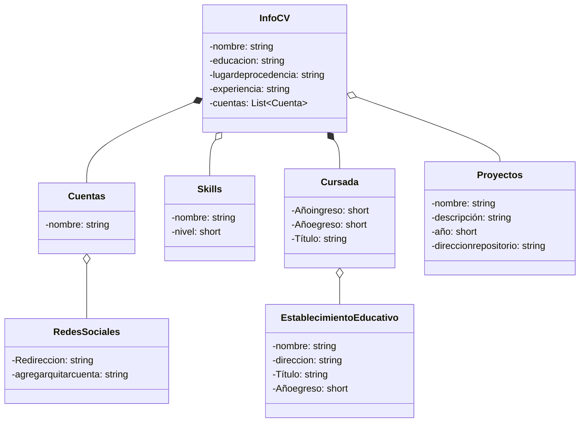

## Diagrama

```mermaid
classDiagram

    class InfoCV{
        -nombre: string
        -educacion: string
        -lugardeprocedencia: string
        -experiencia: string
        -cuentas: List~Cuenta~
    }

    class Cursada{
        -Añoingreso: short
        -Añoegreso: short
        -Título: string
    }

    class EstablecimientoEducativo {
        -nombre: string
        -direccion: string
        -Título: string
        -Añoegreso: short
    }

    Cursada o-- EstablecimientoEducativo

    InfoCV o-- Skills

    InfoCV *-- Cuentas

    Cuentas o-- RedesSociales

    InfoCV o-- Proyectos

    InfoCV *-- Cursada

    class Cuentas {
        -nombre: string
    }

    class RedesSociales {
        -Redireccion: string
        -agregarquitarcuenta: string
    }

    class Proyectos {
        -nombre: string
        -descripción: string
        -año: short
        -direccionrepositorio: string     
    }

    class Skills {
        -nombre: string
        -nivel: short
    }
```