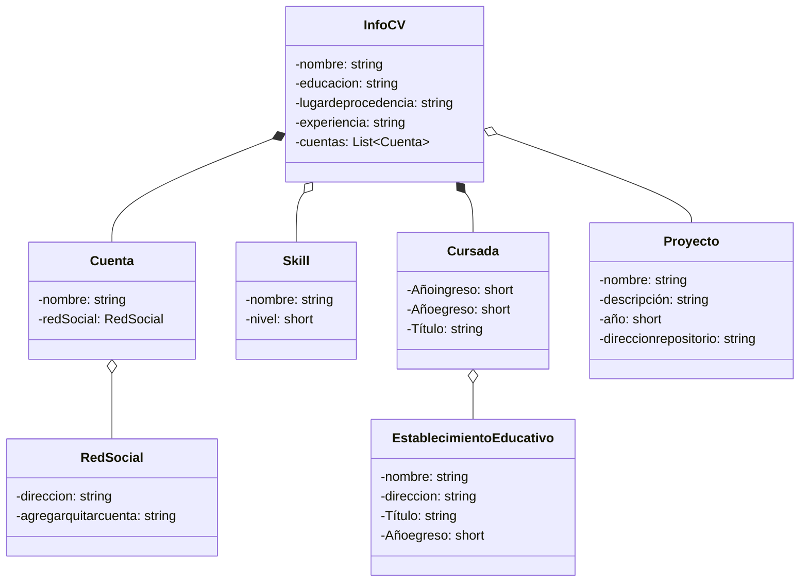

## Diagrama

```mermaid
classDiagram

    class InfoCV{
        -nombre: string
        -educacion: string
        -lugardeprocedencia: string
        -experiencia: string
        -cuentas: List~Cuenta~
    }

    class Cursada{
        -Añoingreso: short
        -Añoegreso: short
        -Título: string
    }

    class EstablecimientoEducativo {
        -nombre: string
        -direccion: string
        -Título: string
        -Añoegreso: short
    }

    Cursada o-- EstablecimientoEducativo

    InfoCV o-- Skill

    InfoCV *-- Cuenta

    Cuenta o-- RedSocial

    InfoCV o-- Proyecto

    InfoCV *-- Cursada

    class Cuenta {
        -nombre: string
        -redSocial: RedSocial
    }

    class RedSocial {
        -direccion: string
        -agregarquitarcuenta: string
    }

    class Proyecto {
        -nombre: string
        -descripción: string
        -año: short
        -direccionrepositorio: string     
    }

    class Skill {
        -nombre: string
        -nivel: short
    }
```